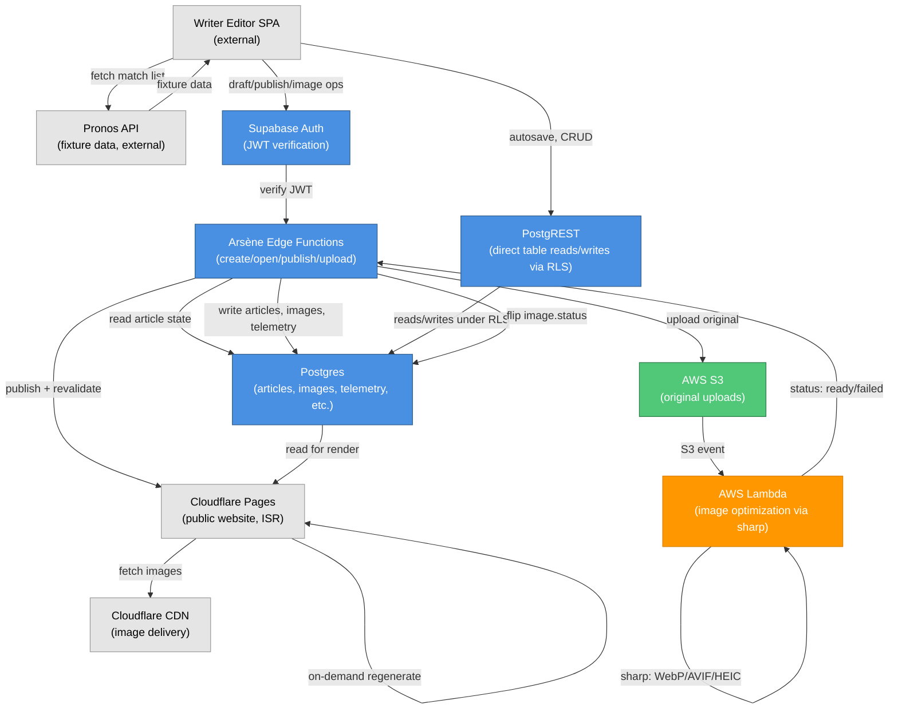

# Architecture

## Overview

Arsène is a Supabase-backed CMS with four server-side atomic operations (draft management, image upload, publish) and direct PostgREST access for everything else. Images land in S3 and are optimized asynchronously by Lambda; the public site uses Cloudflare Pages with on-demand incremental revalidation (ISR), so only the newly published article's page and its category/homepage regenerate on publish—not the entire archive. This design balances cost ($0/mo at launch), publish latency (1–3 minutes rather than 5–10 for a full rebuild), and operational simplicity.

## Components

## Why On-Demand ISR

The public site could rebuild fully on every publish (slow but simple—5–10 minutes for a growing archive) or render every request dynamically (fast for publish but expensive for an all-static site). On-demand incremental revalidation splits the difference: only the changed content regenerates (article page, its category, homepage), giving near-immediate publish-to-live latency (~1–3 minutes including S3/Lambda async image processing and Cloudflare cache purge) without running a live dynamic server for every visitor. This is why Arsène doesn't have a traditional Node server; the server-side work (draft atomicity, image optimization) is split between Supabase Edge Functions (small, synchronous) and Lambda (large, async), while the public site is static HTML regenerated on-demand.

## For Deeper Understanding

- **Why Supabase + ISR over other options?** See [ADR-0001](../pdlc/arsene-cms/adr/0001-supabase-backend-isr-frontend.md) — compares three full options and cost analysis
- **Why S3 + Lambda for images?** See [ADR-0004](../pdlc/arsene-cms/adr/0004-s3-lambda-image-pipeline.md) — Supabase Edge Functions hit a 2-second CPU budget on real photos
- **Full threat model, rollback strategy, observability plan:** See [02-architecture.v1.md](../pdlc/arsene-cms/02-architecture.v1.md) — sections 7–8
